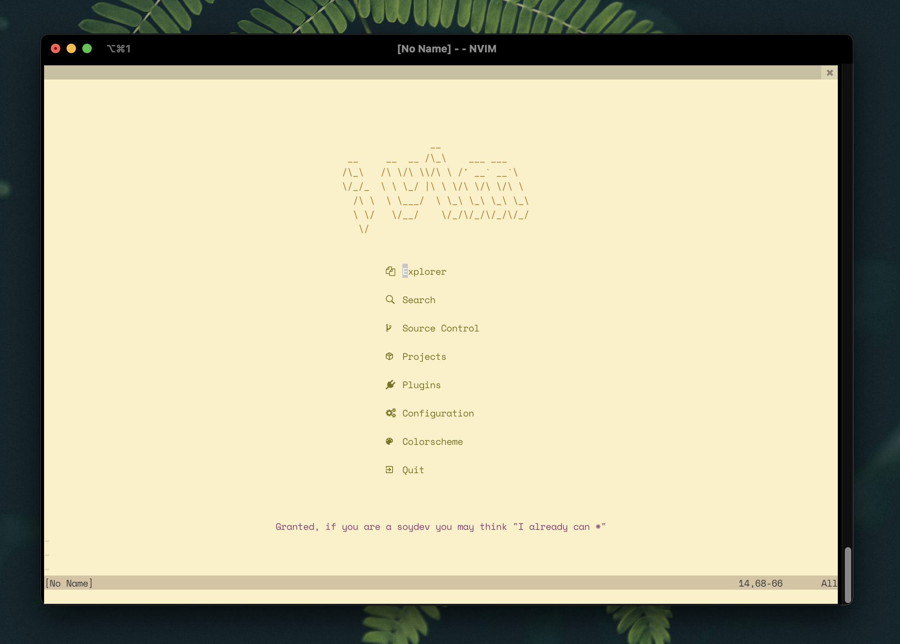

<pre align="center">
                                   
                __                 
 __     __  __ /\_\    ___ ___     
/\_\   /\ \/\ \\/\ \ /' __` __`\   
\/_/_  \ \ \_/ |\ \ \/\ \/\ \/\ \  
  /\ \  \ \___/  \ \_\ \_\ \_\ \_\ 
  \ \/   \/__/    \/_/\/_/\/_/\/_/ 
   \/                              
                                   
                                   
</pre>

> a pure lua neovim configuration



## Requirements 

* [neovim](https://github.com/neovim/neovim/wiki/Installing-Neovim) (version 0.7.0 or higher)

## Installation

Clone this repository into the _.config/nvim_ folder

```shell
git clone https://github.com/3n3a/3n3a-nvim ~/.config/nvim/
```

Afterwards install [**vim-plug**](https://github.com/junegunn/vim-plug)

_Neovim on GNU/Linux_

```shell
sh -c 'curl -fLo "${XDG_DATA_HOME:-$HOME/.local/share}"/nvim/site/autoload/plug.vim --create-dirs \
       https://raw.githubusercontent.com/junegunn/vim-plug/master/plug.vim'
```

Then you can install the plugins with vim-plug

```shell
nvim --headless -c 'PlugInstall' -c 'q!'
```
